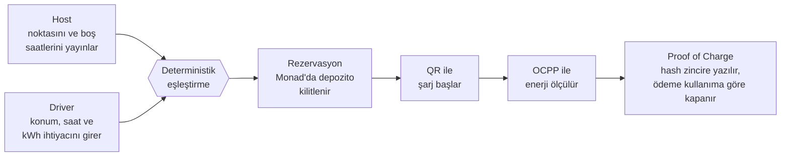

# ChargeMesh

**ChargeMesh turns underused chargers into reservable charging capacity near where drivers are already going.**

Ofis otoparklarında, otellerde ve sitelerde gün boyu boşta bekleyen AC şarj cihazları var. Öte yandan elektrikli araç sürücüleri, gidecekleri yerde şarj olup olamayacaklarını önceden bilemiyor. ChargeMesh bu iki tarafı buluşturuyor: Cihaz sahibi boş saatlerini yayınlıyor, sürücü de nereye gideceğini, orada ne kadar kalacağını ve ne kadar enerjiye ihtiyaç duyduğunu söylüyor. Gerisini sistem hallediyor.

Rezervasyon ve ödeme Monad testnet üzerinde tutuluyor. Şarj oturumu OCPP protokolüyle ölçülüyor ve ödeme, talep edilen enerjiye göre değil, **gerçekten aktarılan enerjiye göre** kapanıyor.

> Bu bir hackathon projesidir. Gerçek şarj hizmeti sunmaz, gerçek para tahsil etmez. Cihaz tarafı bir OCPP simülatörüyle canlandırılır.

## Nasıl çalışır?



1. **Host**, şarj noktasını tanımlar ve uygun olduğu saat aralığını kapasitesiyle birlikte bir *Energy Slot* olarak yayınlar.
2. **Driver**, gideceği yeri, varış ve ayrılış saatini ve ihtiyaç duyduğu enerjiyi girer.
3. Sistem uygun slotları bağlantı tipine, erişim koşuluna, mesafeye ve o sürede karşılanabilecek enerjiye göre sıralar.
4. Driver seçimini onaylar. Backend'in imzaladığı teklif cüzdandan sözleşmeye gönderilir ve depozito kilitlenir.
5. Driver noktaya vardığında cihazdaki QR kodu okutarak şarjı başlatır.
6. Oturum bitince özet çıkarılır, özetin hash'i zincire yazılır. Aktarılan enerjinin bedeli Host'a ödenir, artan depozito Driver'a iade edilir.

Örneğin 20 kWh talep eden bir sürücü 0,2 MON depozito yatırır. Araç 14,5 kWh aldıktan sonra ayrılırsa Host'a 0,145 MON ödenir, sürücüye 0,055 MON geri döner.

## Depo yapısı

```
ChargeMesh/
├── frontend/             Frontend ekibi: Host ve Driver arayüzü (Next.js, wagmi)
├── backend/              Backend ekibi
│   ├── api/              REST API, eşleştirme, OCPP merkezi, zincir istemcisi (Fastify)
│   └── charger-sim/      OCPP 1.6J şarj cihazı simülatörü
├── contracts/            Blockchain ekibi: ChargeMeshEscrow akıllı sözleşmesi (Solidity, Foundry)
├── shared/               Ekipler arası sözleşme: API şemaları, ABI, EIP-712, hash ve ücret hesabı
└── docs/                 Ürün ve teknik spesifikasyon
```

Üç ekibin her biri yalnızca kendi klasöründe çalışır: `frontend/`, `backend/` ve `contracts/`. Ortak tanımlar `shared/` klasöründe, spesifikasyonlar ise `docs/` klasöründe durur. Her klasörün kendi README'si vardır. Spesifikasyonlar `docs/` altında numaralı olarak durur:

| Belge | İçerik |
| --- | --- |
| [01-urun.md](docs/01-urun.md) | Ürün tanımı, roller, sözlük, kapsam |
| [02-mimari.md](docs/02-mimari.md) | Bileşenler, portlar, ortam değişkenleri, durum makineleri |
| [03-api.md](docs/03-api.md) | REST API sözleşmesi, eşleştirme algoritması, Proof of Charge |
| [04-akilli-sozlesme.md](docs/04-akilli-sozlesme.md) | `ChargeMeshEscrow` spesifikasyonu, EIP-712, testler, deploy |
| [05-ocpp.md](docs/05-ocpp.md) | OCPP mesajları ve simülatör davranışı |
| [06-demo-senaryosu.md](docs/06-demo-senaryosu.md) | Kabul testi olarak kullanılan uçtan uca demo |
| [07-paralel-calisma.md](docs/07-paralel-calisma.md) | Sahiplik, dal düzeni, sözleşme değişikliği protokolü, entegrasyon |

## Hızlı başlangıç

### Gereksinimler

- Node.js 22 veya üzeri (corepack Node ile birlikte gelir)
- MongoDB Atlas kümesi, veritabanı kullanıcısı ve API makinesine izin veren IP access list kaydı
- WSL 2 + Ubuntu 24.04 içinde [Foundry](https://getfoundry.sh) (yalnızca sözleşme geliştirme için)
- Tarayıcıda MetaMask ya da benzeri bir cüzdan, testnet MON için [Monad faucet](https://faucet.monad.xyz)

### Kurulum

```powershell
git clone --recurse-submodules https://github.com/bilalabic/ChargeMesh.git
cd ChargeMesh
corepack pnpm install
```

> pnpm'i `corepack` üzerinden çalıştırıyoruz. Böylece herkes `package.json` içinde sabitlenmiş sürümü (pnpm 10) kullanır ve ayrıca bir kurulum yapmak gerekmez.

### Zincire bağlanmadan çalıştırmak

Arayüzü tek başına, sahte verilerle görmek için:

```powershell
Copy-Item frontend/.env.example frontend/.env.local
corepack pnpm dev:frontend          # http://localhost:3000
```

API'yi ve simülatörü zincir olmadan çalıştırmak için:

```powershell
Copy-Item backend/api/.env.example backend/api/.env      # CHAIN_MODE=mock
corepack pnpm --filter @chargemesh/api db:indexes        # Atlas koleksiyon indeksleri
corepack pnpm dev:backend          # REST :4000, OCPP :9000
corepack pnpm dev:sim          # ayrı bir terminalde
```

Yerel zincirle (Anvil) ve Monad testnet'le çalıştırma adımları için [contracts/README.md](contracts/README.md) ve [docs/06-demo-senaryosu.md](docs/06-demo-senaryosu.md) belgelerine bakın.

### Sık kullanılan komutlar

| Komut | Ne yapar |
| --- | --- |
| `corepack pnpm typecheck` | Tüm paketlerde tip kontrolü |
| `corepack pnpm lint` | Tüm paketlerde lint |
| `corepack pnpm test` | Tüm TypeScript testleri |
| `corepack pnpm --filter @chargemesh/shared chain:sync` | Foundry çıktısından ABI ve deploy adreslerini üretir |

## Teknoloji

| Katman | Seçim |
| --- | --- |
| Arayüz | Next.js 16, React 19, Tailwind CSS 4, wagmi 3, viem 2 |
| Backend | Node.js, Fastify 5, MongoDB Atlas, resmi MongoDB Node.js driver |
| Şarj cihazı | OCPP 1.6J (`ocpp-rpc`) |
| Zincir | Monad testnet (chainId 10143), Solidity 0.8.28, Foundry, OpenZeppelin 5 |
| Ortak | TypeScript, zod 4, pnpm workspaces |

## Ekip ve yapay zekâ ajanlarıyla çalışma

Frontend, backend ve blockchain tarafları aynı anda, birbirini beklemeden geliştirilecek şekilde kurgulandı. Ekipler birbirinin koduna değil, `shared` içindeki sözleşmelere ve `docs/` altındaki spesifikasyonlara bağlıdır. Her taraf, karşı tarafı taklit eden bir modla işe başlayabilir: Web sahte veriyle, API zincirsiz modda, sözleşmeler de Foundry testleriyle çalışır.

Proje hem Claude Code hem de Codex ile çalışmaya hazırdır:

- Kökteki ve her alt klasördeki `AGENTS.md`, o alanın kurallarını tanımlar. Codex bu dosyaları doğrudan okur.
- `CLAUDE.md` dosyaları `@AGENTS.md` ile aynı içeriği Claude Code'a aktarır. Böylece iki araç tek bir kaynaktan beslenir.
- `.claude/agents/` altında her alan için hazır Claude Code alt ajanları vardır: `frontend-dev`, `backend-dev`, `contracts-dev` ve `integrator`.

Paralel çalışmanın ayrıntıları, dal düzeni ve entegrasyon kontrol listesi [docs/07-paralel-calisma.md](docs/07-paralel-calisma.md) belgesinde.

## Katkı kuralları

- Commit mesajları İngilizce ve [Conventional Commits](https://www.conventionalcommits.org/) biçimindedir: `feat(frontend): add driver intent form`.
- Her değişiklik kendi dalında yapılır ve PR ile `main` dalına birleştirilir. CI yeşil olmadan birleştirme yapılmaz.
- `.env` dosyaları, özel anahtarlar ve seed phrase'ler hiçbir koşulda depoya girmez. Yalnızca testnet ve yerel ağ kullanılır.

## Sınırlar

Simülatörden gelen ölçüm, gerçek donanımdan bağımsız olarak doğrulanmış bir enerji teslimi anlamına gelmez. Demo, ölçüme dayalı kayıt ve hesaplaşma akışının nasıl işlediğini gösterir. Ticari kullanıma geçmeden önce cihaz erişimi, ölçüm güvenliği, ödeme altyapısı ve şarj hizmetine ilişkin yasal yükümlülüklerin ayrıca ele alınması gerekir.
