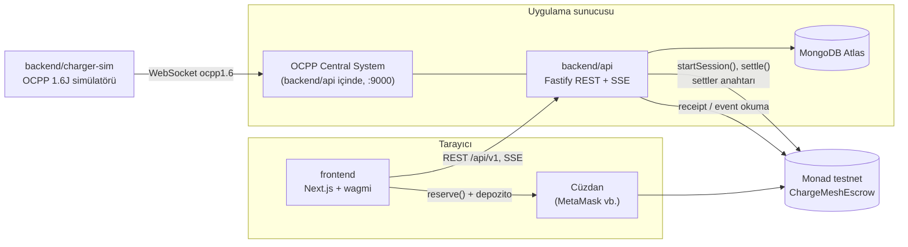
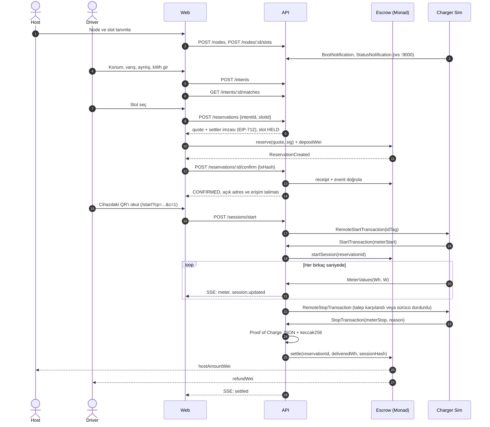
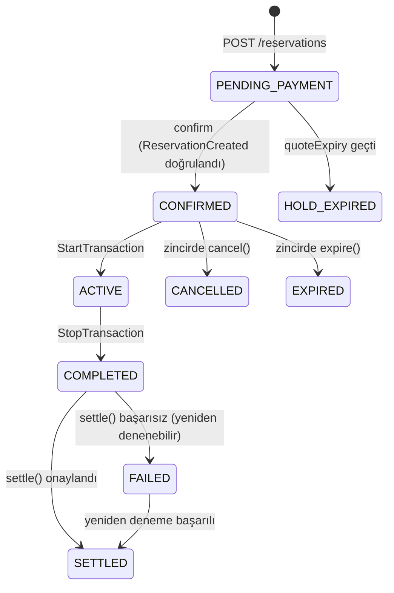

# 02 · Mimari

> Sürüm: v1.0 · Bu belgedeki portlar, ortam değişkenleri ve bileşen sınırları tüm ekipler için bağlayıcıdır.

## Genel görünüm

## Bileşenler ve sahiplik

| Klasör | Bileşen | Sahip ekip | Teknoloji |
| --- | --- | --- | --- |
| `frontend` | Host ve Driver arayüzü | Frontend | Next.js 16 (App Router), React 19, Tailwind CSS 4, wagmi 3, viem 2, TanStack Query 5 |
| `backend/api` | REST API, eşleştirme, OCPP Central System, zincir istemcisi | Backend | Node.js 22+, Fastify 5, MongoDB Atlas, resmi MongoDB Node.js driver, viem 2, ocpp-rpc |
| `backend/charger-sim` | OCPP 1.6J şarj cihazı simülatörü (CLI) | Backend | Node.js, ocpp-rpc |
| `contracts` | `ChargeMeshEscrow` akıllı sözleşmesi | Blockchain | Solidity 0.8.x, Foundry, OpenZeppelin Contracts 5 |
| `shared` | API şemaları, tipler, birim yardımcıları, EIP-712 tanımı, Proof of Charge hash'i, ABI ve deploy adresleri | Ortak (kurallar aşağıda) | TypeScript, zod 4, viem |
| `docs` | Spesifikasyon | Entegrasyon sorumlusu | Markdown |

Foundry, Windows'ta değil WSL (Ubuntu 24.04) içinde çalışır. Diğer tüm araçlar Windows'ta doğrudan çalışır.

## Portlar

| Servis | Adres |
| --- | --- |
| Web | `http://localhost:3000` |
| REST API | `http://localhost:4000/api/v1` |
| API sağlık kontrolü | `http://localhost:4000/health` |
| OCPP Central System | `ws://localhost:9000/ocpp/{chargePointId}` |
| MongoDB Atlas | `MONGODB_URI` ile bağlanır; varsayılan veritabanı adı `chargemesh` |
| Anvil (yerel zincir, WSL) | `http://localhost:8545`, chainId `31337` |

## Ağ bilgileri (Monad testnet)

Kaynak: [docs.monad.xyz](https://docs.monad.xyz/developer-essentials/testnet) (Eylül 2026 itibarıyla doğrulandı).

| Alan | Değer |
| --- | --- |
| Chain ID | `10143` |
| Para birimi | `MON` |
| RPC | `https://testnet-rpc.monad.xyz` (yedek: `https://rpc-testnet.monadinfra.com`) |
| Explorer | `https://testnet.monadvision.com`, `https://testnet.monadscan.com` |
| Faucet | `https://faucet.monad.xyz` |
| Doğrulama (Sourcify) | `--verifier sourcify --verifier-url https://sourcify-api-monad.blockvision.org/` |

> Testnet 2025-12-16'da genesis'ten sıfırlandı. Eski sözleşme adresleri geçersizdir; adres yalnızca `shared/src/chain/deployments.ts` dosyasından okunur.

## Çalışma modları

Ekiplerin birbirini beklemeden çalışabilmesi için her bileşenin bağımsız bir modu vardır:

| Değişken | Değerler | Etki |
| --- | --- | --- |
| `NEXT_PUBLIC_API_MODE` (frontend) | `mock` · `live` | `mock` modunda frontend, `shared` içindeki fixture'larla çalışır ve API'ye ihtiyaç duymaz. |
| `CHAIN_MODE` (backend) | `mock` · `anvil` · `monad` | `mock` modunda zincir çağrıları yapılmaz, sahte tx hash'leri üretilir ve `confirm` her geçerli hash'i kabul eder. `anvil` yerel zinciri, `monad` testnet'i kullanır. |
| `chainMode: "mock"` (frontend + backend birlikte) | – | Frontend `live` modda çalışırken `GET /config` yanıtı `chainMode: "mock"` ise cüzdan açılmaz ve `reserve()` gönderilmez. Frontend, `0x` + 64 hex karakterlik sahte bir tx hash'iyle doğrudan `confirm` çağırır. Böylece frontend ve backend zincir olmadan birlikte test edilebilir. Mock modda API `chainId` olarak `31337` bildirir. |
| `DEMO_ALLOW_ANY_TIME` (backend) | `true` · `false` | `true` olduğunda oturum başlatmada zaman penceresi kontrolü atlanır. Canlı demoda saat uyumsuzluğu yaşanmasın diye vardır. Zincirdeki `endTime` kontrolü yine geçerlidir. |

## Uçtan uca sıra diyagramı

## Durum makineleri

### Reservation (API)

### Energy Slot (API)

`OPEN` → `HELD` (teklif verildi, en fazla 5 dakika) → `RESERVED` (zincirde onaylandı). Teklif süresi dolarsa slot tekrar `OPEN` olur. Host yalnızca `OPEN` durumundaki slotu `CLOSED` yapabilir. Rezervasyon iptal edilirse veya süresi dolarsa slot `OPEN` durumuna döner.

### Sözleşme (zincir)

`None → Reserved → Active → Settled`. Buna ek olarak `Reserved → Cancelled` (başlangıçtan önce, sürücü) ve `Reserved | Active → Expired` geçişleri vardır. Ayrıntılar [04-akilli-sozlesme.md](04-akilli-sozlesme.md) dosyasında.

## Ortam değişkenleri

Her uygulamanın klasöründe bir `.env.example` bulunur. Gerçek `.env` dosyaları **asla** commit edilmez.

| Uygulama | Değişken | Örnek | Açıklama |
| --- | --- | --- | --- |
| frontend | `NEXT_PUBLIC_API_URL` | `http://localhost:4000/api/v1` | |
| frontend | `NEXT_PUBLIC_API_MODE` | `mock` | `mock` veya `live` |
| frontend | `NEXT_PUBLIC_CHAIN_ID` | `10143` | `31337` (anvil) veya `10143` |
| backend | `PORT` | `4000` | |
| backend | `OCPP_PORT` | `9000` | |
| backend | `MONGODB_URI` | `mongodb+srv://<user>:<password>@<cluster>/` | Gizlidir; loglanmaz ve commit edilmez |
| backend | `MONGODB_DB_NAME` | `chargemesh` | Uygulama veritabanı adı |
| backend | `WEB_BASE_URL` | `http://localhost:3000` | QR içindeki başlatma adresi |
| backend | `CHAIN_MODE` | `mock` | `mock`, `anvil` veya `monad` |
| backend | `RPC_URL` | `https://testnet-rpc.monad.xyz` | |
| backend | `SETTLER_PRIVATE_KEY` | *(yalnızca testnet anahtarı)* | Teklif imzalar ve `startSession`/`settle` gönderir |
| backend | `QUOTE_TTL_SECONDS` | `300` | |
| backend | `DEMO_ALLOW_ANY_TIME` | `true` | |
| charger-sim | `CS_URL` | `ws://localhost:9000/ocpp` | |
| charger-sim | `CHARGE_POINT_ID` | `CM-DEMO-001` | |
| charger-sim | `POWER_KW` | `7.4` | |
| charger-sim | `TIME_SCALE` | `120` | Gerçek 1 saniye = simülasyonda 120 saniye |
| charger-sim | `METER_INTERVAL_MS` | `2000` | |
| charger-sim | `VEHICLE_ACCEPT_WH` | *(boş)* | Doluysa araç bu kadar enerji aldıktan sonra kendiliğinden ayrılır |
| contracts | `RPC_URL`, `DEPLOYER_PRIVATE_KEY`, `SETTLER_ADDRESS` | | Yalnızca deploy betiği için |

Sözleşme adresi ortam değişkeninden değil, `shared/src/chain/deployments.ts` dosyasından okunur. Böylece üç bileşen de her zaman aynı adresi kullanır.
