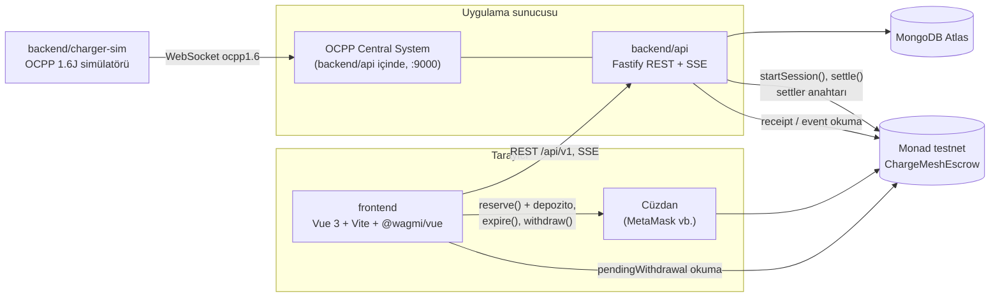
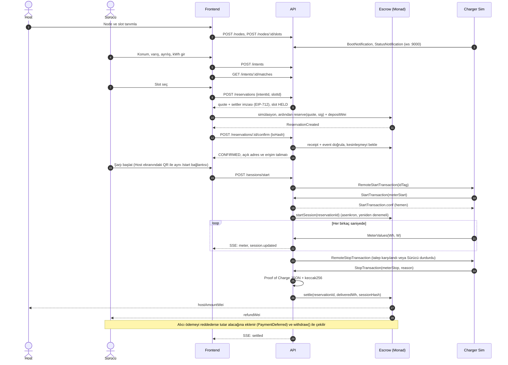
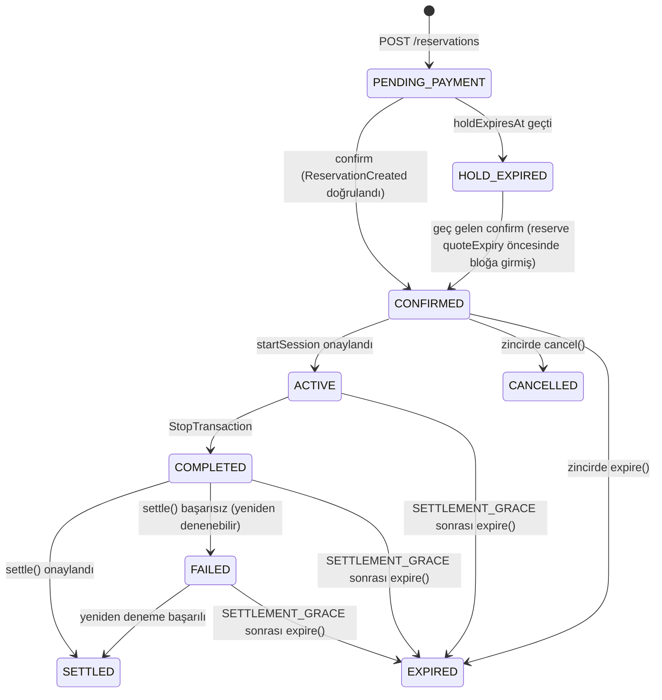
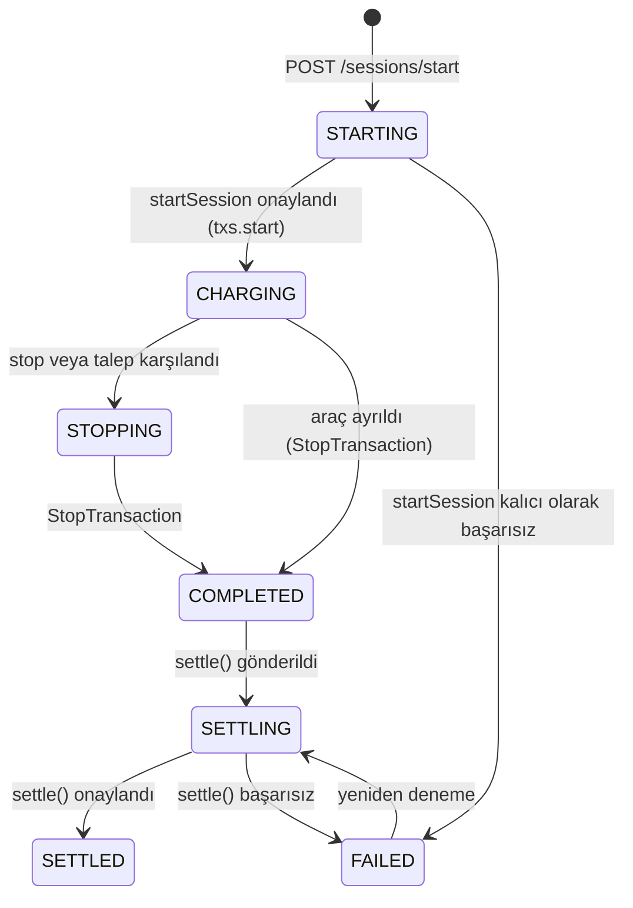

# 02 · Mimari

> Sürüm: v1.1 · Bu belgedeki portlar, ortam değişkenleri ve bileşen sınırları tüm ekipler için bağlayıcıdır.

## Genel görünüm

## Bileşenler ve sahiplik

| Klasör | Bileşen | Sahip ekip | Teknoloji |
| --- | --- | --- | --- |
| `frontend` | Host ve Sürücü arayüzü | Frontend | Vue 3, Vite, Vue Router, Tailwind CSS 4 (`@tailwindcss/vite`), `@wagmi/vue` 0.5, viem 2, `@tanstack/vue-query` 5. Görsel efektler için three.js ve GSAP kullanılabilir. |
| `backend/api` | REST API, eşleştirme, OCPP Central System, zincir istemcisi | Backend | Node.js 22+, Fastify 5, MongoDB Atlas (resmi `mongodb` Node.js driver), viem 2, ocpp-rpc |
| `backend/charger-sim` | OCPP 1.6J şarj cihazı simülatörü (CLI) | Backend | Node.js, ocpp-rpc |
| `contracts` | `ChargeMeshEscrow` akıllı sözleşmesi | Blockchain | Solidity 0.8.x, Foundry, OpenZeppelin Contracts 5 |
| `shared` | API şemaları, tipler, birim yardımcıları, EIP-712 tanımı, Proof of Charge hash'i, ABI, deploy adresleri ve zincir yardımcıları | Ortak (kurallar aşağıda) | TypeScript, zod 4, viem |
| `docs` | Spesifikasyon | Entegrasyon sorumlusu | Markdown |

Foundry, Windows'ta değil WSL (Ubuntu 24.04) içinde çalışır. Diğer tüm araçlar Windows'ta doğrudan çalışır.

## Portlar

| Servis | Adres |
| --- | --- |
| Frontend (Vite geliştirme sunucusu) | `http://localhost:3000` |
| REST API | `http://localhost:4000/api/v1` |
| API sağlık kontrolü | `http://localhost:4000/health` |
| OCPP Central System | `ws://localhost:9000/ocpp/{chargePointId}` |
| MongoDB Atlas | `MONGODB_URI` ile bağlanılır; varsayılan veritabanı adı `chargemesh` |
| Anvil (yerel zincir, WSL) | `http://localhost:8545`, chainId `31337` |

### Veritabanı

Kalıcı veri yalnızca MongoDB Atlas'ta tutulur; yerel bir veritabanı ya da Docker kurulumu yoktur. Bunun iki sonucu var:

- Demo sırasında internet bağlantısı gerekir ve demo makinesinin IP adresi Atlas'taki **IP Access List**'te bulunmalıdır. Başka bir ağa geçilecekse (ör. etkinlik alanının Wi-Fi'ı) liste önceden güncellenir.
- `POST /reservations` gibi atomik adımlar MongoDB transaction'ı kullanır. Transaction yalnızca replica set üzerinde çalışır; Atlas kümeleri (ücretsiz katman dahil) zaten replica set olarak gelir.

## Monad'da dikkat edilecekler

Kaynaklar: [güncel bilgiler](https://docs.monad.xyz/ai/current-facts.md), [Ethereum'dan farklar](https://docs.monad.xyz/developer-essentials/differences), [RPC farkları](https://docs.monad.xyz/reference/rpc-differences), [reserve balance](https://docs.monad.xyz/developer-essentials/reserve-balance), [gaz fiyatlandırması](https://docs.monad.xyz/developer-essentials/gas-pricing), [testnet RPC'leri](https://docs.monad.xyz/developer-essentials/testnets) (Eylül 2026 itibarıyla doğrulandı).

- **Sürüm:** Testnet, Monad v0.16.x (Eylül 2026'da v0.16.2) ve `MONAD_TEN` revizyonuyla çalışır.
- **Blok süresi ve kesinlik:** Bloklar yaklaşık 300 ms'de bir üretilir; kesinlik (finality) 2 blokta, yani yaklaşık 600 ms'de gelir.
- **Receipt'ler spekülatif olabilir.** Henüz kesinleşmemiş bir blok için dönen receipt sonradan değişebilir, hatta kaybolabilir. Bu yüzden backend bir işlemi ancak `finalized` bloğu receipt'in bloğuna ulaştığında (`finalized >= receipt.blockNumber`) onaylanmış sayar. Bunun için shared'daki `waitForFinalized` yardımcısı kullanılır. Pratikte onaya yaklaşık 1 saniye eklenir.
- **Ücret gaz sınırı üzerinden kesilir.** Kesilen tutar `gasLimit × gasPrice`'tır; kullanılmayan gaz iade edilmez. Frontend ve backend bu yüzden gaz sınırını açıkça verir: gaz tahmini + %10.
- **10 MON rezerv kuralı.** Göndericinin bakiyesini 10 MON'un altına düşüren bir işlem revert edebilir. Frontend, `bakiye − depozito − işlem ücreti < 10 MON` olduğunda Sürücü'yü uyarır. Hesaba yeni para geldiyse işlem göndermeden önce birkaç blok (k = 3) beklemek güvenlidir.
- **Log okuma sınırlıdır.** Herkese açık RPC'lerde `eth_getLogs` en fazla 100 blokluk aralık kabul eder, `eth_newFilter` ise desteklenmez. Olay taraması shared'daki parçalı (chunked) log yardımcılarıyla yapılır ve en son taranan blok (cursor) veritabanında saklanır. Tek bir rezervasyonun güncel durumu için olay taramak yerine `getReservation` okunur.
- **Nonce yönetimi.** `pending` etiketi `latest` ile aynı davranır; RPC'den okunan nonce, havuzda bekleyen işlemleri hesaba katmaz. Settler tek bir EOA olduğundan `startSession` ve `settle` işlemleri sıralı bir gönderim kuyruğundan geçer ve nonce yerelde tutulur (viem `nonceManager`).
- **EIP-7702 etkin.** Bir EOA, yetki vererek sözleşme kodu çalıştırıyor olabilir; yani ödeme alıcısı kodlu bir hesap olabilir. Sözleşmenin "gönder, olmazsa alacağına ekle" modeli bu durumu karşılar. Alıcıya iletilecek gaz payı `PUSH_GAS_MARGIN = 50_000` ile korunur (ayrıntı: [04-akilli-sozlesme.md](04-akilli-sozlesme.md#ödeme-modeli)).
- **Zaman damgası saniye hassasiyetindedir.** Aynı saniyedeki bloklar aynı `block.timestamp` değerini taşır. Süre kontrolleri saniye düzeyinde düşünülür.
- **Hız sınırları.** QuickNode (`testnet-rpc.monad.xyz`) saniyede 50 istek, `eth_call` ve `eth_estimateGas` için saniyede 25 istek kabul eder. Yedek RPC (`rpc-testnet.monadinfra.com`) saniyede 20 istekle sınırlıdır ve toplu (batch) istek almaz. Yoklama (polling) aralıkları buna göre seçilir.

## Ağ bilgileri (Monad testnet)

Kaynak: [docs.monad.xyz](https://docs.monad.xyz/developer-essentials/testnet) (Eylül 2026 itibarıyla doğrulandı).

| Alan | Değer |
| --- | --- |
| Chain ID | `10143` |
| Para birimi | `MON` |
| RPC | `https://testnet-rpc.monad.xyz` (yedek: `https://rpc-testnet.monadinfra.com`) |
| Explorer | `https://testnet.monadvision.com`, `https://testnet.monadscan.com` |
| Faucet | `https://faucet.monad.xyz` |
| Doğrulama (Sourcify) | `--verifier sourcify --verifier-url https://sourcify-api-monad.blockvision.org/` |

> Testnet 2025-12-16'da genesis'ten sıfırlandı. Eski sözleşme adresleri geçersizdir; adres yalnızca `shared/src/chain/deployments.ts` dosyasından okunur.

## Çalışma modları

Ekiplerin birbirini beklemeden çalışabilmesi için her bileşenin bağımsız bir modu vardır:

| Değişken | Değerler | Etki |
| --- | --- | --- |
| `VITE_API_MODE` (frontend) | `mock` · `live` | `mock` modunda frontend, `shared` içindeki fixture'larla çalışır ve API'ye ihtiyaç duymaz. Mock modda zincir kimliği her yerde `31337`'dir. |
| `CHAIN_MODE` (backend) | `mock` · `anvil` · `monad` | `mock` modunda zincir çağrıları yapılmaz, sahte tx hash'leri üretilir ve `confirm` biçimi doğru her hash'i kabul eder. `anvil` yerel zinciri, `monad` testnet'i kullanır. |
| `DEMO_ALLOW_ANY_TIME` (backend) | `true` · `false` | `true` olduğunda oturum başlatılırken zaman penceresi kontrol edilmez. Canlı demoda saat farkı sorun çıkarmasın diye vardır. Zincirdeki `endTime` kontrolü yine geçerlidir. |

> **Zincirsiz canlı mod.** Frontend `live` modda çalışırken `GET /config` yanıtında `chainMode: "mock"` gelirse cüzdan açılmaz ve `reserve()` gönderilmez. Frontend, `0x` + 64 hex karakterlik sahte bir tx hash'iyle doğrudan `confirm` çağırır. Böylece frontend ve backend zincir olmadan birlikte test edilebilir. Bu durumda API `chainId` olarak `31337` bildirir.

### Zincir kimliği ve adres nereden okunur?

- **Frontend, `live` mod:** `chainId`, `contractAddress` ve `explorerUrl` **yalnızca** `GET /config` yanıtından alınır. `VITE_CHAIN_ID` yalnızca wagmi'nin varsayılan ağıdır; `/config` ile uyuşmazsa ekranda uyarı çıkar ve kullanıcıdan cüzdanda ağ değiştirmesi istenir.
- **Backend ve frontend `mock` modu:** Sözleşme adresi `getDeployment(chainId)` ile `shared/src/chain/deployments.ts` dosyasından okunur. Adres hiçbir ortam değişkenine yazılmaz; böylece tüm bileşenler her zaman aynı adresi kullanır.

## Demoda QR

Demo tek bir dizüstü bilgisayarda yapılır; telefon veya yerel ağ gerekmez. Host ekranındaki QR kodu (`startUrl`) yalnızca görsel olarak durur. Sürücü aynı bilgisayarda "Şarjı başlat" düğmesine basar ya da `/start` bağlantısını açar.

Bunun iki nedeni var: `startUrl` bir `localhost` adresidir ve telefondan açılamaz. Ayrıca cüzdan tarayıcı eklentisidir (injected) ve yalnızca dizüstü bilgisayardaki tarayıcıda kuruludur.

## Uçtan uca sıra diyagramı

## Durum makineleri

### Reservation (API)

- `HOLD_EXPIRED` tembel (lazy) değerlendirilir: ayrı bir zamanlayıcı yoktur. Rezervasyon veya slot okunurken ya da güncellenirken `holdExpiresAt` geçmişse durum o anda değişir.
- Zincirde `Active` görünen ama API'de `CONFIRMED` kalan bir rezervasyon (ör. `startSession` ile veritabanı yazımı arasında süreç çöktüyse) `sync` ile `ACTIVE` yapılır. Böyle bir rezervasyonda yeni oturum açılamaz; depozito `SETTLEMENT_GRACE` dolduktan sonra `expire()` ile geri alınır.

### Charging Session (API)

`FAILED` durumuna iki yoldan gelinir. Başlatma başarısız olduysa oturum orada biter, rezervasyon `CONFIRMED` kalır ve aynı rezervasyonla yeni bir oturum açılabilir. `settle` başarısız olduysa rezervasyon da `FAILED` olur ve backend hesaplaşmayı yeniden dener.

### Energy Slot (API)

`OPEN` → `HELD` (teklif verildi; `QUOTE_TTL_SECONDS` kadar, varsayılan 300 sn, üzerine 60 sn tolerans) → `RESERVED` (zincirde onaylandı).

- Slot, kendisini tutan rezervasyonun kimliğini saklar ve her slot geçişi bu kimliğe göre filtrelenir. Böylece bir rezervasyonun senkronizasyonu, başka bir rezervasyonun tuttuğu slotu yanlışlıkla açamaz.
- Tutma süresi dolarsa slot yeniden `OPEN` olur. Rezervasyon zincirde iptal edilir ya da süresi dolarsa (`cancel`, `expire`) slot da `OPEN` durumuna döner.
- Hesaplaşması tamamlanan (`SETTLED`) slot zincirde dolu kalır ve yeniden satılmaz.
- Host yalnızca `OPEN` durumundaki slotu `CLOSED` yapabilir.

### Sözleşme (zincir)

`None → Reserved → Active → Settled`. Buna ek olarak `Reserved → Cancelled` (başlangıçtan önce, Sürücü) ve `Reserved | Active → Expired` geçişleri vardır. Ayrıntılar [04-akilli-sozlesme.md](04-akilli-sozlesme.md) dosyasında.

## Ortam değişkenleri

Her uygulamanın klasöründe bir `.env.example` bulunur. Gerçek `.env` dosyaları **asla** commit edilmez.

| Uygulama | Değişken | Örnek | Açıklama |
| --- | --- | --- | --- |
| frontend | `VITE_API_URL` | `http://localhost:4000/api/v1` | Yalnızca `live` modda kullanılır |
| frontend | `VITE_API_MODE` | `mock` | `mock` veya `live` |
| frontend | `VITE_CHAIN_ID` | `10143` | wagmi'nin varsayılan ağı: `31337` (anvil) veya `10143`. `live` modda asıl kaynak `GET /config`'tir. |
| backend | `NODE_ENV` | `development` | `development`, `test` veya `production`. `production` iken `POST /demo/seed` kapalıdır. |
| backend | `PORT` | `4000` | |
| backend | `OCPP_PORT` | `9000` | |
| backend | `MONGODB_URI` | `mongodb+srv://<user>:<password>@<cluster>/` | Gizlidir; loglanmaz ve commit edilmez |
| backend | `MONGODB_DB_NAME` | `chargemesh` | Uygulama veritabanı adı. Paralel çalışan API'ler farklı ad kullanır. |
| backend | `WEB_BASE_URL` | `http://localhost:3000` | QR içindeki başlatma adresinin kökü. CORS'ta izin verilen origin de budur. |
| backend | `CHAIN_MODE` | `mock` | `mock`, `anvil` veya `monad` |
| backend | `RPC_URL` | `https://testnet-rpc.monad.xyz` | Boşsa moda göre varsayılan kullanılır (`anvil`: `http://localhost:8545`, `monad`: `https://testnet-rpc.monad.xyz`). |
| backend | `SETTLER_PRIVATE_KEY` | *(yalnızca testnet anahtarı)* | Teklif imzalar, `startSession`/`settle` gönderir. `anvil` ve `monad` modlarında zorunludur; `mock` modda boş bırakılırsa geçici bir anahtar üretilir. |
| backend | `QUOTE_TTL_SECONDS` | `300` | Teklifin geçerlilik süresi (30–3600 sn) |
| backend | `RECONCILIATION_INTERVAL_MS` | `30000` | Yarım kalan start/settlement işlemlerini başlangıçta ve bu aralıkla uzlaştırır (5000–300000 ms). |
| backend | `DEMO_ALLOW_ANY_TIME` | `true` | Verilmezse `NODE_ENV` `production` değilken `true`, `production`'da `false` olur. |
| charger-sim | `CS_URL` | `ws://localhost:9000/ocpp` | `chargePointId` sona eklenir. |
| charger-sim | `CHARGE_POINT_ID` | `CM-DEMO-001` | |
| charger-sim | `CONNECTOR_ID` | `1` | |
| charger-sim | `POWER_KW` | `7.4` | |
| charger-sim | `TIME_SCALE` | `120` | Gerçek 1 saniye = simülasyonda 120 saniye |
| charger-sim | `METER_INTERVAL_MS` | `2000` | |
| charger-sim | `METER_START_WH` | `1000000` | Sayacın başlangıç değeri |
| charger-sim | `VEHICLE_ACCEPT_WH` | *(boş)* | Doluysa araç bu kadar enerji aldıktan sonra kendiliğinden ayrılır |
| contracts | `RPC_URL`, `DEPLOYER_PRIVATE_KEY`, `SETTLER_ADDRESS` | | Yalnızca deploy betiği için |
